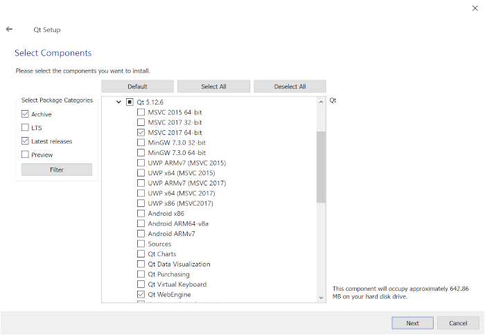

Configure Windows for RStudio Development
=============================================================================

These instructions are intended for a clean Windows-10 machine and may not
produce a successful build environment if any dependencies are already 
installed.

Bootstrap
=============================================================================
- Open an Administrator PowerShell and execute this command:
    - `Set-ExecutionPolicy Bypass -Scope Process -Force; iex ((New-Object System.Net.WebClient).DownloadString('https://raw.githubusercontent.com/rstudio/rstudio/master/dependencies/windows/Install-RStudio-Prereqs.ps1'))`
- Wait for the script to complete

Install Qt SDK
=============================================================================
Install Qt 5.12.6 SDK for Windows from https://qt.io, selecting 
following components:

- MSVC 2017 64-bit
- QtWebEngine

To install via the Qt online installer (recommended by Qt), when you reach the "Select Components"
screen, click the "Archive" checkbox then the Filter button. The list of available versions will
expand to include 5.12.6, as seen here:

Alternatively, the offline installer may be used:

http://download.qt.io/official_releases/qt/5.12/5.12.6/qt-opensource-windows-x86-5.12.6.exe

Clone the Repo and Run Batch File
=============================================================================
- Open Command Prompt (non-administrator); do this **after** running the 
PowerShell bootstrapping script above to pick up environment changes
- optional: if you will be making commits, configure git (your email address, name, ssh keys, etc.)
- `cd` to the location you want the repo
- Clone the repro, e.g. `git clone https://github.com/rstudio/rstudio`
- `cd rstudio\dependencies\windows`
- `install-dependencies.cmd`
- Wait for the script to complete

Build Java/Gwt
=============================================================================
- `cd rstudio\src\gwt`
- `ant draft` or for iterative development of Java/Gwt code, `ant desktop`

Build C++
=============================================================================
- Open Qt Creator
- Open Project and select rstudio\src\cpp\CMakelists.txt
- Select the 64-bit kit (The Qt-part of RStudio for Windows is 64-bit only)
- (Optional but recommended): Change the `CMake generator` for the kit to 
`Ninja` for faster incremental builds
- Click Configure, then build

Run RStudio
=============================================================================
- From command prompt, `cd` to the build location, and run `rstudio.bat`
- To run RStudio in Qt Creator, select the rstudio run configuration and
change the working directory to be the root of the build output directory,
i.e. the parent of the `desktop` directory containing rstudio.exe 

Debug RStudio
=============================================================================
- Debug using Qt's debugger

Package Build
=============================================================================
This is not necessary for regular development work, but can be used to fully 
test your installation. This builds RStudio and bundles it up in a setup package.

In a non-administrator command prompt:
- `cd rstudio\package\win32`
- `make-package.bat`

When done, the setup is `rstudio\package\build\RStudio-99.9.9.exe`.

